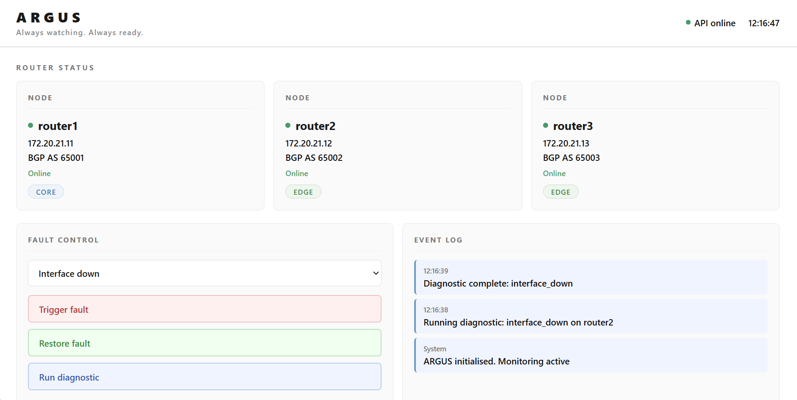
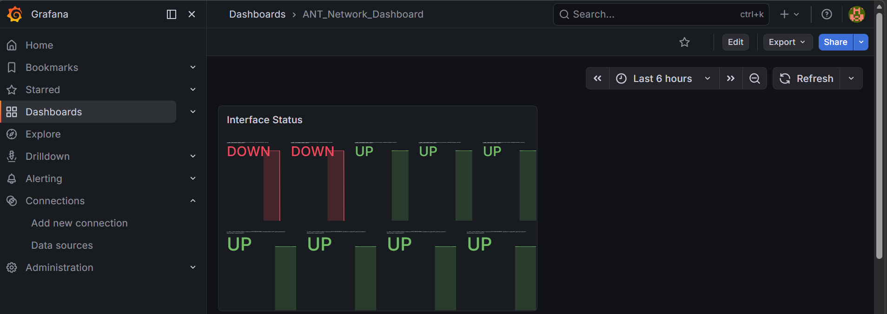
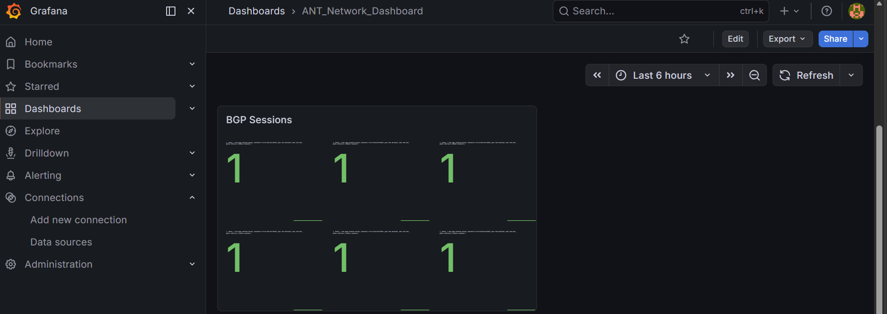
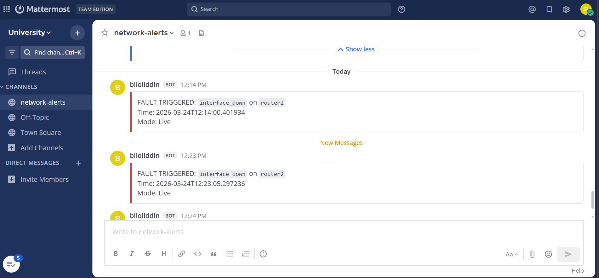
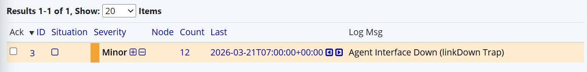

# Automated Network Troubleshooting (ARGUS)

ARGUS is a network automation system that watches your infrastructure around the clock. When something breaks, it automatically figures out what happened, runs the right diagnostics, and delivers a full report to your engineers.


---

## Live Demo

Try it right now:

- **ARGUS Dashboard:** https://biloliddin131313.github.io/argus/
- **REST API:** https://web-production-4de00.up.railway.app/api/status

---

## How it works

A fault happens on the network. Within seconds:

1. The router fires an SNMP trap to OpenNMS
2. OpenNMS logs the alarm
3. The runbook engine detects it and identifies the fault type
4. Diagnostic commands run automatically on the affected router
5. A full report lands in Mattermost
6. Grafana updates to show what went down

---

## Architecture

The system is built in four layers, each with a clear job:

- **Network layer** — Three virtual Arista cEOS routers running BGP, generating real SNMP traps when faults occur
- **Monitoring layer** — OpenNMS receives traps, Prometheus collects metrics every 30 seconds
- **Automation layer** — Python runbook engine polls for alarms and executes diagnostics automatically
- **Visualisation layer** — ARGUS dashboard and Grafana panels show everything in real time

---

## Technology Stack

| Component | Tool |
|---|---|
| Virtual network | ContainerLab + Arista cEOS |
| Alert monitoring | OpenNMS |
| Metrics collection | Prometheus |
| Automation engine | Python + Flask |
| Notifications | Mattermost |
| Dashboards | Grafana |
| Analyst interface | ARGUS |

---

## Dashboards

| ARGUS | Grafana |
|------|--------|
|  |  |
| BGP Monitoring | Alerts | Network Monitoring |
|---------------|--------|-------------------|
|  |  |  |

---

## Project Structure
```
containerlab/        Virtual topology, router configs, and lab orchestration
automation/          REST API, runbook engine, Prometheus exporter, and workflow automation
dashboard/           ARGUS analyst UI with alert triage and enrichment
monitoring/          Full Docker Compose stack (Prometheus, Grafana, Alertmanager)
docs/images/         Project screenshots and architecture diagrams
```

Or use the startup script which does everything automatically:
```bash
bash start.sh
```

Then open `dashboard/index.html` in your browser.

---

## API Endpoints

| Method | Endpoint | Description |
|---|---|---|
| GET | /api/status | System health check |
| GET | /api/routers | List all routers |
| GET | /api/faults | Fault scenarios and recent log |
| POST | /api/fault/trigger | Trigger a fault |
| POST | /api/fault/restore | Restore a fault |
| POST | /api/diagnostic/run | Run diagnostic commands |
| GET | /api/runbooks | List all runbooks |

---

## Fault Scenarios

The system handles four fault types out of the box:

- **Interface down** — detects and diagnoses a link failure on router2
- **BGP neighbourship change** — handles a BGP session drop on router1
- **Hardware fault** — responds to an error-disabled interface on router3
- **Route flap** — detects route withdrawal instability on router3

---

## Services and Ports

| Service | Port |
|---|---|
| ARGUS REST API | 5001 |
| Runbook engine | 5002 |
| OpenNMS | 8980 |
| Mattermost | 8065 |
| Grafana | 3001 |
| Prometheus | 9090 |
| Metrics exporter | 9200 |

---

## Requirements

- Docker and Docker Compose
- ContainerLab 0.73+
- Python 3.12+
- Arista cEOS image imported as ceos:latest
- Python packages: flask, flask-cors, requests, netmiko, prometheus-client

